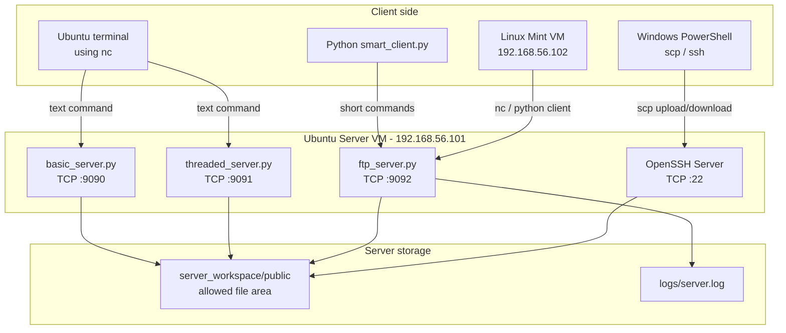
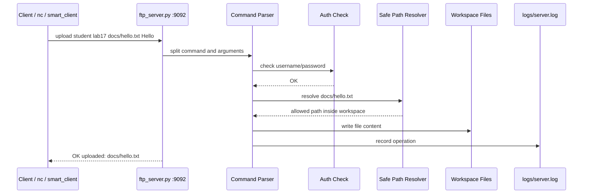
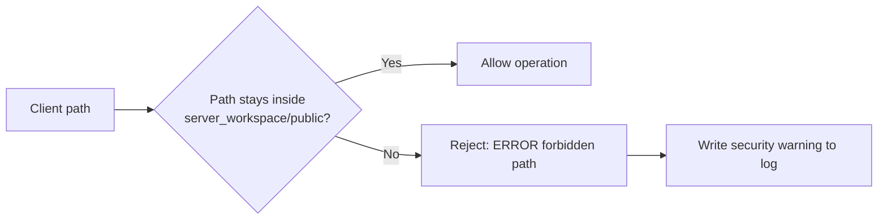

# LAB17 — Учебный FTP-like сервер на Python: TCP, файлы, авторизация, SCP и безопасность

**Уровень:** beginner → advanced  
**ОС сервера:** Ubuntu 24.04 inside Oracle VM VirtualBox  
**Рекомендуемый IP сервера:** `192.168.56.101`  
**Дополнительная клиентская VM:** Linux Mint, если на университетском Windows нет прав администратора  
**Базовый источник идеи:** https://github.com/fa-python-network/5_FTP_server

---

## 0. Назначение лабораторной работы

В этой лабораторной работе студент создаёт собственный учебный файловый сервер на Python. Сервер работает по TCP, принимает текстовые команды от клиента, выполняет файловые операции внутри разрешённой папки и возвращает ответ.

Важно: это **не промышленный FTP-сервер** и не полная реализация официального FTP-протокола. Это учебная модель, которая помогает понять базовые принципы сетевой передачи файлов, клиент–серверного взаимодействия, авторизации, многопоточности и безопасной работы с путями файловой системы.

После этой лабораторной студенту будет намного проще понимать настоящие инструменты вроде `scp`, `sftp`, FTP-серверов, SSH, сетевых сокетов и серверной безопасности.

---

## 1. Что студент изучит

К концу LAB17 студент сможет:

1. Объяснить модель **client–server** простыми словами.
2. Написать TCP-сервер на Python с использованием модуля `socket`.
3. Сделать сервер, который обслуживает несколько клиентов через `threading`.
4. Реализовать команды файлового сервера: `help`, `pwd`, `ls`, `mkdir`, `rmdir`, `upload`, `download`, `cat`, `rename`, `rm`, `quit`.
5. Понять, почему нужны разные порты для разных версий сервера.
6. Проверять сервер через `nc`, Python-клиент и Linux Mint VM.
7. Использовать `scp` для реальной передачи файлов между клиентом и сервером.
8. Предотвращать простую атаку **directory traversal**, например `../../etc/passwd`.
9. Вести логирование действий сервера.
10. Подготовить лабораторную работу как GitHub portfolio project.

---

## 2. Почему используются разные порты

В LAB17 есть 3 серверные программы. Они не должны работать на одном и том же порту, иначе возникнет ошибка `Address already in use`.

| Файл | Порт | Назначение |
|---|---:|---|
| `basic_server.py` | `9090` | первый простой сервер для понимания TCP |
| `threaded_server.py` | `9091` | многопоточный сервер для нескольких клиентов |
| `ftp_server.py` | `9092` | финальный FTP-like сервер с авторизацией, логами и безопасными путями |

Проверить открытые порты можно так:

```bash
ss -tulnp | grep 909
```

Если порт занят, остановите старую программу через `Ctrl+C` или найдите процесс:

```bash
sudo lsof -i :9092
```

---

## 3. Общая архитектура LAB17



---

## 4. Как работает один запрос



---

## 5. Безопасность: почему нельзя доверять пути от клиента

Клиент может отправить опасный путь:

```text
../../etc/passwd
```

Если сервер слепо откроет такой путь, пользователь сможет прочитать системные файлы. Поэтому финальный сервер использует `Path.resolve()` и проверяет, что итоговый путь остаётся внутри `server_workspace/public`.



---

## 6. Подготовка Ubuntu 24.04 Server VM

Установите необходимые инструменты:

```bash
sudo apt update
sudo apt install python3 python3-venv python3-pip netcat-openbsd tree curl iproute2 net-tools openssh-server lsof -y
sudo systemctl enable --now ssh
```

Проверьте Python:

```bash
python3 --version
```

Проверьте IP сервера:

```bash
ip addr show
```

Для VirtualBox Host-only Adapter в этой лабораторной ожидается:

```text
192.168.56.101
```

Если у вас другой IP, используйте именно ваш адрес.

---

## 7. Создание проекта без Git clone

В этой версии лабораторной студент **не клонирует готовый репозиторий**. Он создаёт файлы сам, чтобы понять структуру проекта и назначение каждого файла.

Создайте папки:

```bash
mkdir -p ~/LAB17_FTP_SERVER
cd ~/LAB17_FTP_SERVER

mkdir -p server_workspace/public
mkdir -p client_downloads
mkdir -p logs
mkdir -p tests
mkdir -p screenshots
```

Проверьте структуру:

```bash
tree
```

Ожидаемо:

```text
.
├── client_downloads
├── logs
├── screenshots
├── server_workspace
│   └── public
└── tests
```

---

## 8. Учебный протокол команд

Финальный сервер принимает одну команду на одно TCP-соединение. Это важно для понимания `nc`.

Формат команд с авторизацией:

```text
command username password [arguments]
```

Данные для входа:

```text
username: student
password: lab17
```

Правильные команды:

```text
help
login student lab17
pwd student lab17
ls student lab17
mkdir student lab17 docs
upload student lab17 hello.txt Привет из клиента
download student lab17 hello.txt
rename student lab17 hello.txt message.txt
rm student lab17 message.txt
quit
```

### Важное замечание про `nc`

Команда ниже открывает новое соединение, отправляет `login`, получает ответ и сразу закрывает соединение:

```bash
echo "login student lab17" | nc 127.0.0.1 9092
```

Следующая команда снова откроет **новое соединение**. Поэтому сервер не помнит предыдущий login:

```bash
echo "mkdir docs" | nc 127.0.0.1 9092
```

Поэтому при использовании `nc` нужно писать логин и пароль в каждой защищённой команде:

```bash
echo "mkdir student lab17 docs" | nc 127.0.0.1 9092
```

---

## 9. Task 1 — Basic TCP server на порту 9090

### Идея перед кодом

Первый сервер нужен для начинающих. Он показывает главный принцип: клиент подключается к IP и порту, отправляет текст, сервер читает текст и возвращает ответ.

Создайте файл:

```bash
nano basic_server.py
```

Вставьте код:

```python
"""
LAB17 - Basic TCP File Server
Port: 9090
Purpose: first step for beginners. It accepts one command per TCP connection.
"""
import os
import socket

HOST = "0.0.0.0"
PORT = 9090
WORKSPACE = "server_workspace/public"

os.makedirs(WORKSPACE, exist_ok=True)


def process(request: str) -> str:
    """Process a small set of commands without authentication."""
    request = request.strip()

    if not request:
        return "ERROR empty request"

    if request == "help":
        return "OK commands: help, pwd, ls, mkdir <folder>, quit"

    if request == "quit":
        return "OK goodbye"

    if request == "pwd":
        return "OK /"

    if request == "ls":
        items = os.listdir(WORKSPACE)
        return "OK " + ("\n".join(items) if items else "empty directory")

    if request.startswith("mkdir "):
        folder_name = request.split(" ", 1)[1].strip()
        if not folder_name:
            return "ERROR folder name is required"
        path = os.path.join(WORKSPACE, folder_name)
        os.makedirs(path, exist_ok=True)
        return f"OK folder created: {folder_name}"

    return "ERROR unknown command"


def main() -> None:
    print(f"Basic server is listening on {HOST}:{PORT}")
    print(f"Workspace: {WORKSPACE}")

    with socket.socket(socket.AF_INET, socket.SOCK_STREAM) as server:
        server.setsockopt(socket.SOL_SOCKET, socket.SO_REUSEADDR, 1)
        server.bind((HOST, PORT))
        server.listen(5)

        while True:
            conn, addr = server.accept()
            with conn:
                print(f"Client connected: {addr}")
                data = conn.recv(4096)
                if not data:
                    conn.sendall(b"ERROR empty request")
                    continue
                response = process(data.decode("utf-8", errors="replace"))
                conn.sendall(response.encode("utf-8"))


if __name__ == "__main__":
    main()
```

Запустите сервер:

```bash
python3 basic_server.py
```

В другом терминале проверьте:

```bash
echo "help" | nc 127.0.0.1 9090
echo "pwd" | nc 127.0.0.1 9090
echo "mkdir docs" | nc 127.0.0.1 9090
echo "ls" | nc 127.0.0.1 9090
```

---

## 10. Task 2 — Threaded server на порту 9091

### Идея перед кодом

Обычный сервер обслуживает одного клиента за раз. В реальных системах несколько клиентов могут подключаться одновременно. Для этого мы используем `threading`: каждое подключение получает отдельный поток.

Создайте файл:

```bash
nano threaded_server.py
```

Вставьте код из файла `threaded_server.py` финальной версии проекта или используйте готовый файл из пакета преподавателя.

Запустите:

```bash
python3 threaded_server.py
```

Проверьте:

```bash
echo "help" | nc 127.0.0.1 9091
echo "upload note.txt Hello from threaded server" | nc 127.0.0.1 9091
echo "cat note.txt" | nc 127.0.0.1 9091
```

Для проверки нескольких клиентов откройте несколько терминалов и отправьте команды одновременно.

---

## 11. Task 3 — Final FTP-like server на порту 9092

### Идея перед кодом

Финальный сервер добавляет важные профессиональные элементы:

- авторизация `student / lab17`;
- разные файловые команды;
- логирование в `logs/server.log`;
- безопасная обработка путей;
- многопоточность;
- понятные ответы `OK` и `ERROR`.

Создайте файл:

```bash
nano ftp_server.py
```

Вставьте код из файла `ftp_server.py` финальной версии проекта.

Запустите сервер:

```bash
python3 ftp_server.py
```

Проверьте команды через `nc`:

```bash
echo "help" | nc 127.0.0.1 9092
echo "login student lab17" | nc 127.0.0.1 9092
echo "pwd student lab17" | nc 127.0.0.1 9092
echo "mkdir student lab17 docs" | nc 127.0.0.1 9092
echo "upload student lab17 docs/hello.txt Hello from Lab17" | nc 127.0.0.1 9092
echo "ls student lab17 docs" | nc 127.0.0.1 9092
echo "cat student lab17 docs/hello.txt" | nc 127.0.0.1 9092
echo "download student lab17 docs/hello.txt" | nc 127.0.0.1 9092
echo "rename student lab17 docs/hello.txt docs/message.txt" | nc 127.0.0.1 9092
echo "rm student lab17 docs/message.txt" | nc 127.0.0.1 9092
```

Проверьте защиту от выхода за пределы рабочей папки:

```bash
echo "cat student lab17 ../../etc/passwd" | nc 127.0.0.1 9092
```

Ожидаемый ответ:

```text
ERROR forbidden path outside workspace
```

---

## 12. Почему команда `login` не работает как постоянная сессия в `nc`

Если студент делает так:

```bash
echo "login student lab17" | nc 127.0.0.1 9092
echo "mkdir docs" | nc 127.0.0.1 9092
```

вторая команда будет ошибочной, потому что это новое TCP-соединение. `nc` не хранит состояние между командами.

Правильно для `nc`:

```bash
echo "mkdir student lab17 docs" | nc 127.0.0.1 9092
```

Правильно для `smart_client.py`:

```text
login student lab17
mkdir docs
upload docs/note.txt This file was created from smart client
ls docs
cat docs/note.txt
```

---

## 13. Task 4 — Smart client

### Идея перед кодом

Чтобы студенту не приходилось каждый раз писать `student lab17`, мы создаём умный клиент. Он принимает короткую команду, автоматически добавляет логин и пароль, отправляет команду серверу и показывает ответ.

Создайте файл:

```bash
nano smart_client.py
```

Вставьте код из файла `smart_client.py` финальной версии проекта.

Запустите финальный сервер в одном терминале:

```bash
python3 ftp_server.py
```

Во втором терминале запустите клиента:

```bash
python3 smart_client.py
```

Пример работы:

```text
myftp@shell$ login student lab17
OK login successful
myftp@shell$ mkdir docs
OK folder created: docs
myftp@shell$ upload docs/note.txt This file was created from smart client
OK uploaded: docs/note.txt
myftp@shell$ ls docs
OK note.txt
myftp@shell$ cat docs/note.txt
OK
This file was created from smart client
myftp@shell$ save docs/note.txt local_note.txt
OK saved to client_downloads/local_note.txt
myftp@shell$ quit
OK goodbye
Client closed.
```

---

## 14. Task 5 — Проверка из Linux Mint VM

### Зачем нужна Linux Mint VM

В университете студент может не иметь прав администратора на Windows-компьютере. Например, он не может редактировать hosts file или устанавливать некоторые инструменты. Поэтому удобно создать вторую VM с Linux Mint и использовать её как клиент.

Настройка:

| VM | Роль | Пример IP |
|---|---|---|
| Ubuntu 24.04 | сервер | `192.168.56.101` |
| Linux Mint | клиент | `192.168.56.102` |

На Linux Mint установите инструменты:

```bash
sudo apt update
sudo apt install netcat-openbsd python3 openssh-client -y
```

Проверьте соединение:

```bash
ping 192.168.56.101
```

Проверьте сервер:

```bash
echo "help" | nc 192.168.56.101 9092
echo "mkdir student lab17 from_mint" | nc 192.168.56.101 9092
echo "upload student lab17 from_mint/test.txt Hello from Linux Mint" | nc 192.168.56.101 9092
echo "cat student lab17 from_mint/test.txt" | nc 192.168.56.101 9092
```

Если соединения нет, проверьте firewall на Ubuntu:

```bash
sudo ufw status
sudo ufw allow 9092/tcp
```

---

## 15. Task 6 — Использование SCP для реальной передачи файлов

### Что такое SCP

`scp` — это команда для безопасного копирования файлов между машинами через SSH. В отличие от нашего учебного TCP-сервера, `scp` использует OpenSSH, шифрование, системных пользователей Linux и порт `22`.

Документация: https://man.openbsd.org/scp.1  
Ubuntu OpenSSH Server: https://ubuntu.com/server/docs/openssh-server

### 15.1 Проверка SSH на Ubuntu Server

На Ubuntu Server:

```bash
sudo systemctl status ssh
```

Если SSH не установлен:

```bash
sudo apt update
sudo apt install openssh-server -y
sudo systemctl enable --now ssh
```

Проверьте IP:

```bash
ip addr show
```

---

### 15.2 Upload файла с Linux Mint на Ubuntu Server

На Linux Mint создайте файл:

```bash
echo "Hello from Linux Mint client" > mint_upload.txt
```

Отправьте файл на Ubuntu Server:

```bash
scp mint_upload.txt mohannad@192.168.56.101:/home/mohannad/LAB17_FTP_SERVER/server_workspace/public/
```

Замените `mohannad` на имя пользователя вашей Ubuntu VM.

На Ubuntu Server проверьте:

```bash
ls -l ~/LAB17_FTP_SERVER/server_workspace/public/
cat ~/LAB17_FTP_SERVER/server_workspace/public/mint_upload.txt
```

---

### 15.3 Download файла с Ubuntu Server на Linux Mint

На Linux Mint выполните:

```bash
scp mohannad@192.168.56.101:/home/mohannad/LAB17_FTP_SERVER/server_workspace/public/mint_upload.txt ./downloaded_from_server.txt
```

Проверьте:

```bash
cat downloaded_from_server.txt
```

---

### 15.4 Копирование папки через SCP

Отправить папку:

```bash
scp -r my_folder mohannad@192.168.56.101:/home/mohannad/LAB17_FTP_SERVER/server_workspace/public/
```

Скачать папку:

```bash
scp -r mohannad@192.168.56.101:/home/mohannad/LAB17_FTP_SERVER/server_workspace/public/my_folder ./my_folder_copy
```

---

### 15.5 SCP из Windows PowerShell

Если на Windows доступен OpenSSH Client, можно выполнить:

```powershell
scp .\hello.txt mohannad@192.168.56.101:/home/mohannad/LAB17_FTP_SERVER/server_workspace/public/
```

Скачать файл:

```powershell
scp mohannad@192.168.56.101:/home/mohannad/LAB17_FTP_SERVER/server_workspace/public/hello.txt .\hello_downloaded.txt
```

Если Windows не позволяет использовать нужные инструменты, используйте Linux Mint VM как клиент.

---

## 16. Разница между нашим сервером и SCP

| Критерий | LAB17 FTP-like server | SCP |
|---|---|---|
| Протокол | учебный TCP protocol | SSH/SCP |
| Шифрование | нет | да |
| Пользователи | `student/lab17` внутри кода | реальные Linux users |
| Порт | `9092` | `22` |
| Цель | обучение socket/file protocol | реальная безопасная передача файлов |
| Безопасность | учебная защита путей | промышленный уровень через SSH |

---

## 17. Проверка логов

Финальный сервер пишет логи в:

```bash
logs/server.log
```

Проверить последние записи:

```bash
tail -n 20 logs/server.log
```

Проверить security warning:

```bash
echo "cat student lab17 ../../etc/passwd" | nc 127.0.0.1 9092
tail -n 20 logs/server.log
```

---

## 18. Быстрый финальный тест

Запустите финальный сервер:

```bash
python3 ftp_server.py
```

В другом терминале выполните:

```bash
echo "help" | nc 127.0.0.1 9092
echo "login student lab17" | nc 127.0.0.1 9092
echo "mkdir student lab17 docs" | nc 127.0.0.1 9092
echo "upload student lab17 docs/final.txt Final LAB17 test" | nc 127.0.0.1 9092
echo "ls student lab17 docs" | nc 127.0.0.1 9092
echo "download student lab17 docs/final.txt" | nc 127.0.0.1 9092
echo "cat student lab17 ../../etc/passwd" | nc 127.0.0.1 9092
```

Ожидаемые признаки успеха:

- `help` возвращает список команд;
- `login` возвращает `OK login successful`;
- `mkdir` создаёт папку;
- `upload` создаёт файл;
- `download` возвращает содержимое файла;
- опасный путь возвращает ошибку безопасности.

---

## 19. Частые ошибки

### Ошибка: `Address already in use`

Причина: порт уже занят.

Решение:

```bash
sudo lsof -i :9092
```

Остановите старый процесс или используйте правильный порт.

---

### Ошибка: `Connection refused`

Причина: сервер не запущен или выбран неправильный порт.

Проверьте:

```bash
python3 ftp_server.py
ss -tulnp | grep 9092
```

---

### Ошибка: `ERROR invalid username or password`

Причина: команда требует логин и пароль.

Неправильно для `nc`:

```bash
echo "mkdir docs" | nc 127.0.0.1 9092
```

Правильно:

```bash
echo "mkdir student lab17 docs" | nc 127.0.0.1 9092
```

---

### Ошибка: Linux Mint не подключается к Ubuntu

Проверьте:

```bash
ping 192.168.56.101
sudo ufw status
sudo ufw allow 9092/tcp
```

Также проверьте VirtualBox Network: обе VM должны быть в одной Host-only network.

---

### Ошибка SCP: `Permission denied`

Проверьте имя пользователя Ubuntu:

```bash
whoami
```

Проверьте SSH:

```bash
sudo systemctl status ssh
```

Проверьте путь назначения. Лучше использовать домашнюю папку пользователя, например:

```bash
/home/mohannad/LAB17_FTP_SERVER/server_workspace/public/
```

---

## 20. Задание для отчёта студента

В отчёт нужно добавить:

1. Скриншот IP адреса Ubuntu Server.
2. Скриншот запуска `basic_server.py` на порту `9090`.
3. Скриншот проверки `basic_server.py` через `nc`.
4. Скриншот запуска `threaded_server.py` на порту `9091`.
5. Скриншот запуска `ftp_server.py` на порту `9092`.
6. Скриншот успешного `upload/download`.
7. Скриншот ошибки безопасности для `../../etc/passwd`.
8. Скриншот работы `smart_client.py`.
9. Скриншот SCP upload/download.
10. Краткое объяснение: чем отличается учебный TCP file server от SCP.

---

## 21. Grading checklist

| Критерий | Баллы |
|---|---:|
| Создана структура проекта | 5 |
| Работает basic server на 9090 | 10 |
| Работает threaded server на 9091 | 10 |
| Работает final FTP-like server на 9092 | 20 |
| Реализованы файловые команды | 15 |
| Авторизация работает корректно | 10 |
| Защита от directory traversal | 10 |
| Smart client работает без повторного ввода логина в каждой команде | 10 |
| SCP upload/download выполнены | 5 |
| Отчёт со скриншотами и объяснениями | 5 |
| **Итого** | **100** |

---

## 22. Минимальные источники для студента

- Python socket documentation: https://docs.python.org/3/library/socket.html
- Python threading documentation: https://docs.python.org/3/library/threading.html
- Python pathlib documentation: https://docs.python.org/3/library/pathlib.html
- OpenBSD scp manual: https://man.openbsd.org/scp.1
- Ubuntu OpenSSH Server guide: https://ubuntu.com/server/docs/openssh-server
- Original educational idea repository: https://github.com/fa-python-network/5_FTP_server

---

## 23. Final note

Эта лабораторная работа специально построена от простого к профессиональному:

1. сначала студент понимает TCP;
2. затем видит проблему нескольких клиентов;
3. затем добавляет авторизацию и безопасные пути;
4. затем сравнивает свой учебный сервер с реальным инструментом `scp`.

Такой порядок помогает не просто копировать код, а понимать сетевую инженерию, Linux-практику и серверное программирование.
